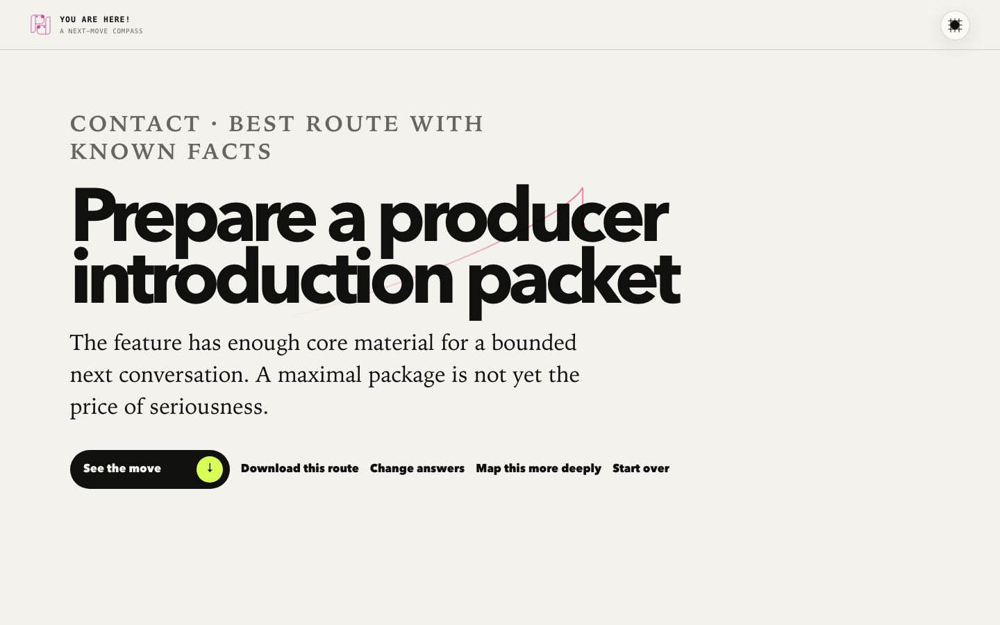

<p align="center">
  
</p>

# You Are Here!

**[Open the live tool](https://pitchdog-you-are-here.dog-pitch.chatgpt.site)**

**Find the next useful move. The answer is not always another deck.**

You Are Here maps the live pitch situation—film, advertising, startups, education, and more—then gives one bounded next move with the reason, what to bring, and what not to waste time building yet.

[](https://github.com/bomkino/pitchdog-you-are-here/actions/workflows/ci.yml)

<p align="center">
  
</p>

## Two ways through

- **Quick map:** five structured choices.
- **Expert map:** explicit opt-in, up to 16 questions and more than 80 choices across route, relationship, stage, authority, readiness, access, evidence, rights, budget, timing, and delivery.

No typing. No fake interpretation. Every answer belongs to a branch in the decision tree.

## What it returns

One primary move, not a report avalanche. The result explains why, names the minimum material to bring, flags prerequisites, and lets you go deeper only if you choose.

The downloadable route now carries the full useful answer—move, finish line, reasoning, expert changes, parked work, and limits—so the context does not vanish the moment the browser closes.

This is pitch-work routing—not crisis assessment, therapy, legal advice, or a personality quiz.

Selections stay in the browser. No runtime AI, account, database, analytics, upload, or email gate.

## Run and verify

Requires Node.js 22.18 or newer.

```bash
npm install
npm run dev
npm run verify
```

`npm run verify` runs TypeScript checks, product tests, the production build, and hosting-contract tests.

## How it is built

- `src/content.ts` — quick and expert choice trees
- `src/decide.ts` — deterministic route and next-move logic
- `src/main.ts` — journey, progress, result, and expert upgrade
- `src/ui.ts` / `src/base.css` — accessible shell, theme, cursor, and scroll discipline
- `tests/` — route, result, and hosting contracts
- `docs/PRODUCT-CONTRACT.md` — what the compass can and cannot know

## Contributing and reuse

Read [CONTRIBUTING.md](CONTRIBUTING.md), [CODE_OF_CONDUCT.md](CODE_OF_CONDUCT.md), and [SECURITY.md](SECURITY.md).

Software and documentation: [AGPL-3.0-or-later](LICENSE). Original visual assets: [CC BY-SA 4.0](ASSET-LICENSE.md). The pitch.dog name and logo remain subject to [TRADEMARKS.md](TRADEMARKS.md).
